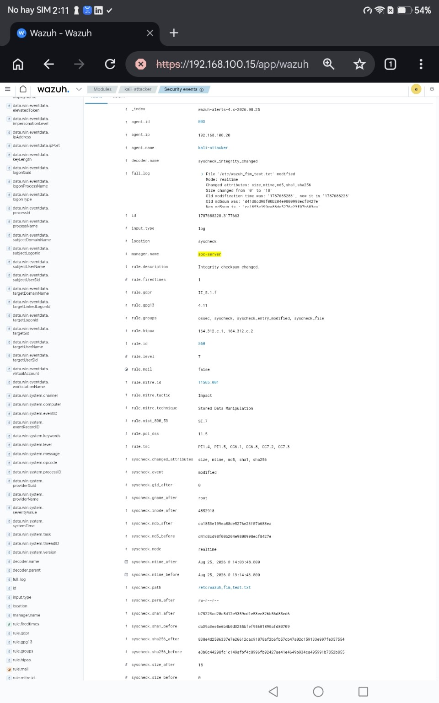
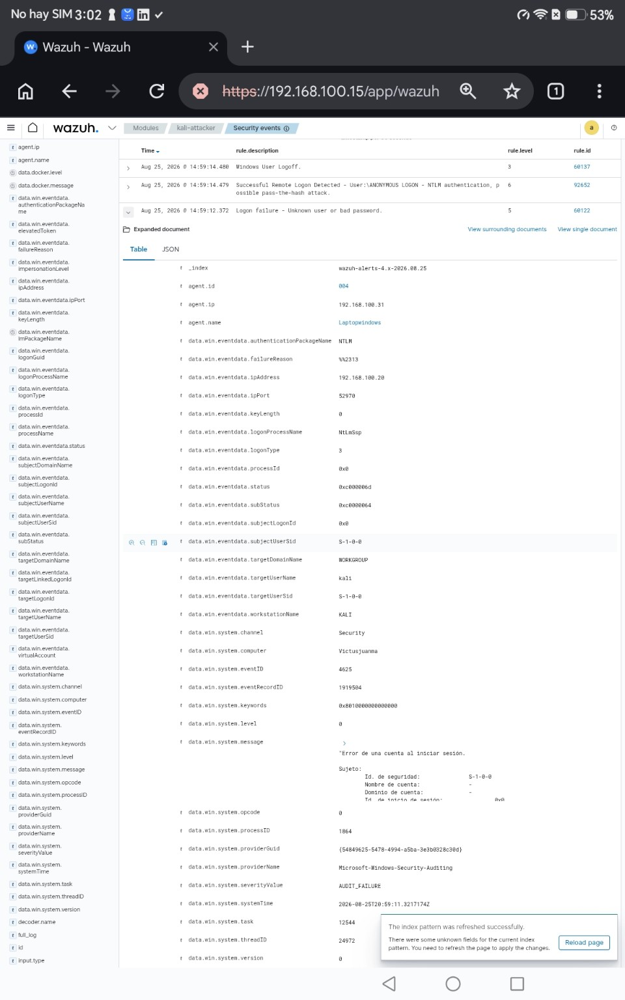
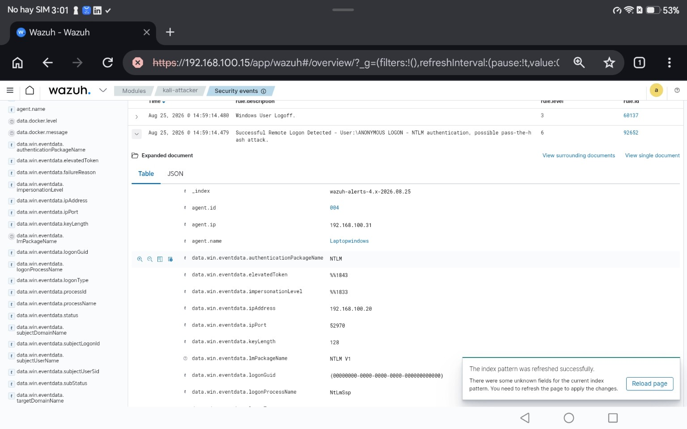
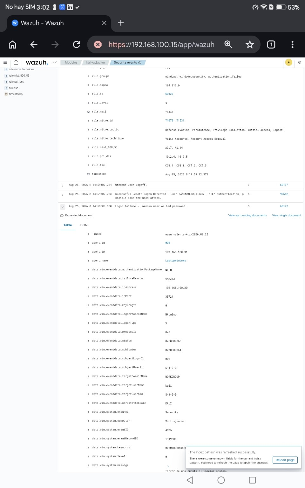
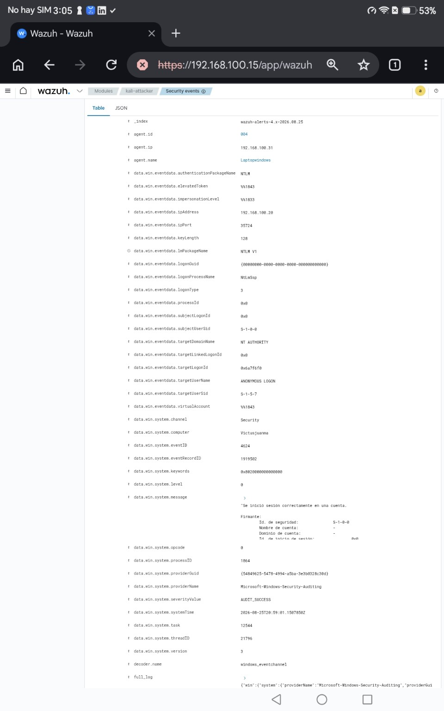

# Home SOC Lab

Hands-on Security Operations Center (SOC) lab built to practice security monitoring, detection, incident analysis, troubleshooting, and operational documentation in a realistic multi-system environment.

## Overview

This lab combines endpoint telemetry, SIEM monitoring, network segmentation, observability, and controlled attack/testing activity.

### Core components

- **Wazuh 4.7.5** — Manager, Indexer, Dashboard
- **Kali Linux** — attacker/test endpoint and Wazuh agent
- **Windows** — monitored endpoint and Wazuh agent
- **pfSense** — firewall/network component
- **Docker / Portainer**
- **Prometheus**
- **Grafana**
- **Node Exporter**
- **cAdvisor**
- **VirtualBox**

## Architecture

The lab is hosted on a Windows system using VirtualBox.

```text
                    +----------------------+
                    |     Windows Host     |
                    |      VirtualBox      |
                    +----------+-----------+
                               |
          +--------------------+--------------------+
          |                    |                    |
          v                    v                    v
+------------------+  +------------------+  +------------------+
|    SOC Server    |  |   Kali Linux     |  | Windows Endpoint |
|  192.168.100.15  |  | 192.168.100.20   |  | 192.168.100.31   |
|                  |  | Wazuh Agent 003  |  | Wazuh Agent 004  |
| Wazuh Manager    |  +------------------+  +------------------+
| Wazuh Indexer    |
| Wazuh Dashboard  |          +------------------+
| Docker           |          |     pfSense      |
| Prometheus       |          | Firewall / Lab   |
| Grafana          |          +------------------+
| Portainer        |
| cAdvisor         |
+------------------+
```

## Detection and Validation Highlights

### 1. File Integrity Monitoring — Positive Detection

A controlled modification was performed on:

```text
/etc/wazuh_fim_test.txt
```

Wazuh detected the change in **realtime**.

Key evidence:

- Agent: `kali-attacker`
- Agent ID: `003`
- Decoder: `syscheck_integrity_changed`
- Rule ID: `550`
- Rule level: `7`
- Description: `Integrity checksum changed.`
- Mode: `realtime`
- MITRE ATT&CK: `T1565.001 — Stored Data Manipulation`

This test validated endpoint File Integrity Monitoring and real-time alert generation.

#### Evidence



*Wazuh realtime FIM alert from `kali-attacker`: Rule 550, Level 7, `syscheck_integrity_changed`, with the modified path `/etc/wazuh_fim_test.txt` and MITRE ATT&CK T1565.001.*

### 2. Kali → SMB → Windows Authentication Failure

A controlled SMB authentication attempt was performed from Kali Linux against the Windows endpoint.

Source:

```text
192.168.100.20
```

Destination:

```text
192.168.100.31:445
```

Wazuh correlated the Windows authentication failure.

Key evidence:

- Windows Event ID: `4625`
- Wazuh Rule ID: `60122`
- Rule level: `5`
- Logon Type: `3`
- Authentication package: `NTLM`
- Source IP: `192.168.100.20`
- User: `kali`
- Workstation: `KALI`

A related remote logon event was also observed:

- Windows Event ID: `4624`
- Wazuh Rule ID: `92652`
- Rule level: `6`
- User: `ANONYMOUS LOGON`
- Authentication: `NTLM`
- Source IP: `192.168.100.20`

#### Evidence



*Controlled SMB authentication failure from Kali (`192.168.100.20`) to the Windows endpoint. Wazuh records Event ID 4625, Logon Type 3 and Rule 60122.*



*Related remote logon observed by Wazuh from the same Kali source IP, using NTLM authentication.*

<details>
<summary>Additional event evidence</summary>



*Second controlled authentication-failure event from the same SMB test sequence.*



*Detailed Windows Event ID 4624 evidence showing Logon Type 3, NTLM and source IP `192.168.100.20`.*

</details>

### 3. Windows Local Failed Logon

Controlled local failed-login attempts generated:

- Windows Event ID: `4625`
- Wazuh Rule ID: `60122`
- Rule level: `5`
- Group: `authentication_failed`

This test confirmed endpoint authentication monitoring.

### 4. SYN Scan — Negative Detection Result

A SYN scan was executed from Kali Linux:

```bash
sudo nmap -sS -Pn 192.168.100.31
```

The Windows host was reachable, but the scanned TCP ports returned filtered/no-response results.

No correlated Wazuh alert was identified for this test.

This result is intentionally documented as a **detection coverage finding**, not hidden or treated as a SIEM failure. It highlights the importance of validating telemetry sources and understanding where network detection requires additional visibility or controls.

## Troubleshooting and Operations

The lab also documents real operational issues and their resolution, including:

- Wazuh agent duplicate/stale identity problems
- Agent re-enrollment without reinstalling the endpoint software
- Wazuh Manager ports `1514/TCP` and `1515/TCP`
- Wazuh Indexer memory pressure and JVM heap tuning
- Windows firewall behavior affecting SMB/445 testing
- Validation of agent connectivity after full lab restart
- Resource pressure management on a 16 GB Windows host

## Documentation

Detailed supporting documentation is available in [`docs/`](docs/):

- [Manual Maestro SOC](docs/Manual_Maestro_SOC_GitHub.pdf) — architecture, implementation history, decisions, troubleshooting, tests, and evidence
- [Runbook Técnico SOC](docs/Runbook_Tecnico_SOC_GitHub.pdf) — operational and rebuild procedures
- [Recruiter Evidence Brief](docs/SOC_Lab_Recruiter_Evidence_GitHub.pdf) — concise two-page overview of the project and key evidence

## Repository Structure

```text
home-soc-lab/
├── README.md
├── docs/
├── evidence/
├── diagrams/
└── configs/
```

The `evidence`, `diagrams`, and `configs` directories will be expanded as additional validated artifacts are published.

## Skills Demonstrated

This project demonstrates practical experience with:

- SIEM monitoring and alert triage
- Wazuh administration and troubleshooting
- Windows Security Event analysis
- Linux endpoint monitoring
- File Integrity Monitoring
- Authentication event correlation
- SMB / NTLM troubleshooting
- Network connectivity validation
- MITRE ATT&CK mapping
- Incident analysis
- Root-cause troubleshooting
- Security lab design
- Technical documentation
- Git / GitHub workflow
- Infrastructure observability

## Evidence Policy

Only evidence generated by actual lab executions is published as test evidence.

Screenshots and results are kept associated with the specific test that produced them. Missing details are not inferred or reconstructed as fact.

## Status

The lab is operational and continues to evolve. New tests, validated evidence, and configuration examples will be added incrementally.

---

**Purpose:** Professional cybersecurity / SOC portfolio project demonstrating hands-on detection, troubleshooting, monitoring, and incident-analysis capability.
